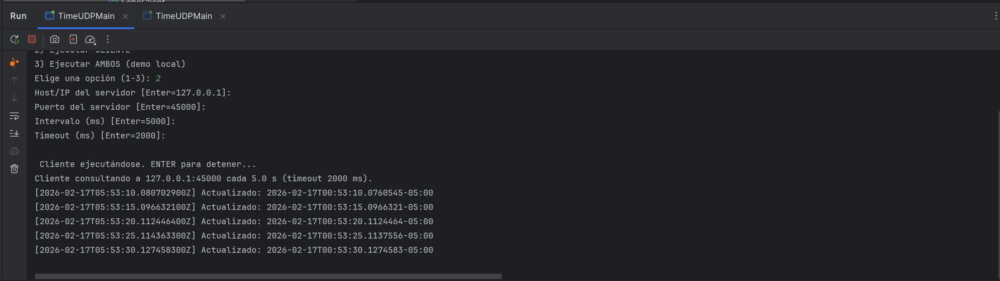
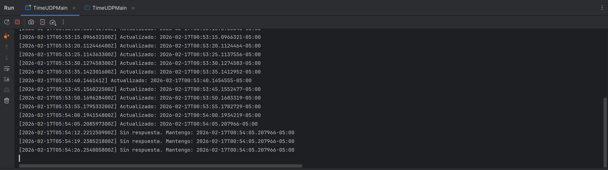
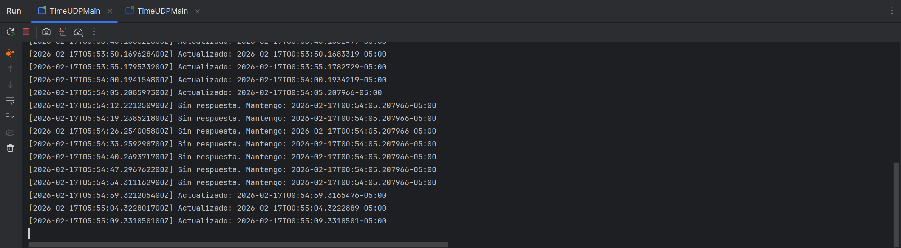
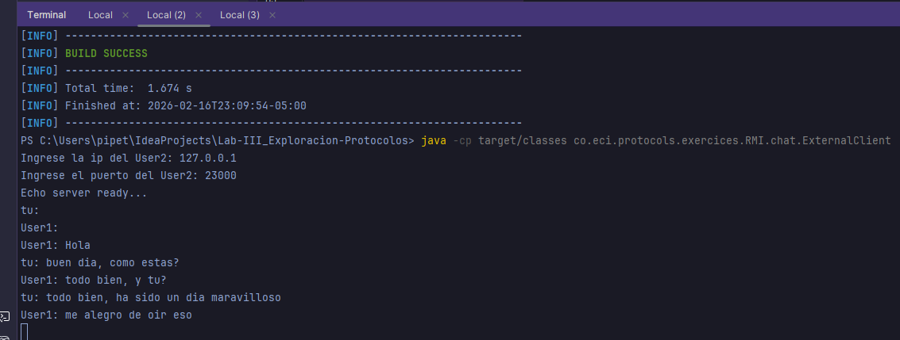
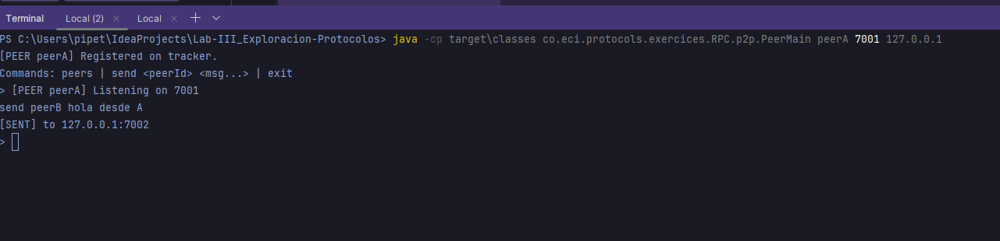

# ╰┈➤ -【🌐】 | Lab III: Exploración Protocolos ┆⤿⌗

---

## 👥 Autores

* Sofia Nicolle Ariza Goenaga
* Daniel Palacios Moreno
* Marlio Jose Charry Espitia

---

## 📖 Objetivo del Laboratorio

Este laboratorio presenta un estudio sistemático de los protocolos de comunicación, abordando desde los conceptos fundamentales de URLs hasta implementaciones complejas de sistemas distribuidos. Cada ejercicio está diseñado para desarrollar competencias prácticas en la implementación de protocolos de red utilizando Java 21.

**Meta**: Adquirir dominio técnico en protocolos de red para el desarrollo de aplicaciones conectadas.

---

## 🗺️ Estructura de Contenidos

### 🌐 **Módulo 3: Análisis de URLs**
*Estudio de componentes y estructura de direcciones web*

#### 📍 Ejercicio 3.1: Extracción de Componentes URL
- **Objetivo**: Analizar y extraer componentes estructurales de URLs
- **Técnicas**: Implementación de métodos `getProtocol()`, `getHost()`, `getPort()`, `getQuery()`
- **Resultado**: Análisis completo de estructura de URLs mediante consola

para este ejercicio teniamos que  usar los metodos de get que  tiene la clase URL los cuales son los siguientes: getProtocol, getAuthority, getHost, getPort, getPath, getQuery, getFile, getRef. Y ya con esto simplemente imprimimos la informacion en la terminal

#### 📍 Ejercicio 3.2: Interfaz de Análisis URL
- **Objetivo**: Desarrollo de interfaz gráfica para análisis de URLs
- **Implementación**: Extensión del ejercicio anterior con componentes GUI
- **Resultado**: Aplicación de escritorio para análisis visual de URLs

Para este ejercicio teniamos que generar una GUI basica que permitiera al usuario escribir una URL y si esta era valida mostrara la informacion que se conseguia en el anterior ejercicio por lo que se realizo la GUI basica y se le realizaron unos pequeños cambios al codigo del ejercicio anterior

---

### 🔌 **Módulo 4: Comunicación mediante Sockets**
*Implementación de protocolos de transporte TCP*

#### 📍 Ejercicio 4.3.1: Sistema Cliente-Servidor
- **Objetivo**: Implementar comunicación bidireccional mediante sockets
- **Funcionalidad**: Procesamiento matemático (cálculo de cuadrados)
- **Resultado**: Sistema cliente-servidor con intercambio de datos

Para este ejercicio teniamos que usar un ServerSockket y un cliente que se pudieran comunicar entre ellos y el cliente pudiera mandar un numero al  servidor y el servidor devolviera el cubo del numero que hyaa recibido por parte del cliente por lo que se modifico el codigo dado en la guia  tanto de la Figura 2 como la Figura 3 para terminar de  hacerlo 

#### 📍 Ejercicio 4.3.2: Servidor de Funciones Trigonométricas
- **Objetivo**: Servidor con capacidades de procesamiento matemático intercambiables
- **Característica**: Selección dinámica de funciones (cos, sin, tan)
- **Resultado**: Sistema adaptable con cambio de algoritmos en runtime

Para este ejercicio teniamos que realizar algo similar que el ejercicio pasado pero en este caso que el usuario recibiera la solucion de una de 3 operaciones trigonometricas ya fuera coseno, seno o tangente, escribiendo el numero en este caso el numero de radianes desde el cliente y por defecto la funcion que funciona es coseno pero si el cliente escribe fun:sin por ejemplo el servidor pasara a resolver los numeros que le lleguen con la operacion de seno

#### 📍 Ejercicio 4.4: Servidor HTTP Fundamental
- **Objetivo**: Implementación básica de servidor web
- **Implementación**: Protocolo HTTP con respuesta HTML personalizada
- **Resultado**: Servicio web funcional en `localhost:35000`

en este ejercicio unicamente teniamos que implementar el codigo que se nos da en la guia en la figura 4 y posteriormente correr el servidor e intentarnos conectar desde localhost:35000 desde nuestro navegador donde nos aparecera simplemente una pagina que diga My Web Site confirmando la conexion al servidor pero el servidor una vez manda la respuesta del request se apaga

#### 📍 Ejercicio 4.5.1: Servidor HTTP Completo
- **Objetivo**: Desarrollo de servidor web con capacidades extendidas
- **Funcionalidades**:
  - 📁 Servido de archivos estáticos (HTML, CSS, JS, imágenes)
  - 🛡️ Manejo de códigos de estado HTTP (404, 403, 405)
  - 🔍 Detección automática de tipos MIME
  - 🔄 Procesamiento concurrente de peticiones
- **Resultado**: Servidor web con características de producción

para este ejercicio teniamos que hacer un servidor el cual nos permitiera realizar multiples requests al mismo tiempo sin ser de manera concurrente permitiendo al cliente en este caso al navegador pedir el index.html o pedir las imagenes tanto para mostrar como para descargarlas y lo que hace el servidor por dentro es lo siguiente: 

1. Lo que se realizo en este ejercicio fue crear un servidor con un ServerSocket en el puerto 35000 el cual permite la conexion una vez el servidor esta corriendo si se conecta a localhost:35000
2. entra en un bucle infinito el cual permite  aceptar un cliente y leer peticiones HTTP 
3. verifica que la request contenga en su header un GET para confirmar que es una peticion tipo GET
4. convierte el "/" en "/index.html" lo cual le permite al cliente recibir el html que en este caso permite mostrar el html de manera visual en el navegador
5. resuelve el WEB_ROOT del servidor para poder despues ubicar las imagenes que necesita
6. despues si la persona necesita la imagen para ser descargada o vista en una pestaña aparte lo lee como bytes y se los manda al cliente 
7. si no existe la imagen o la persona intenta crear una request indebida muestara un 404 not found

---
### 📡 **Módulo 5: Protocolo UDP**
*Estudio de comunicación no orientada a conexión*

#### 📍 Ejercicio 5.2.1: Sistema de Sincronización UDP
- **Objetivo**: Implementar cliente-servidor con sincronización temporal
- **Especificaciones**:
  - ⏰ Consulta periódica (5 segundos) de hora del servidor
  - 🔄 Mecanismo de reconexión automática ante caídas
  - 💾 Persistencia de última hora conocida
  - 🛡️ Implementación de timeout para prevención de bloqueos
- **Resultado**: Sistema tolerante a fallos con recuperación automática

En este ejercicio se pedía implementar, usando UDP (Datagramas), un sistema cliente-servidor donde el servidor responde con la hora actual cada vez que recibe una solicitud, y el cliente consulta esa hora cada 5 segundos; si en algún momento no llega respuesta (por ejemplo, porque el servidor se apaga durante la prueba), el cliente debe seguir ejecutándose y mantener la última hora recibida, reintentando hasta que el servidor vuelva a estar disponible y entonces actualizarse nuevamente. Para cumplirlo, se dejó el servidor escuchando en un bucle atendiendo múltiples datagramas y se mejoró el cliente con un timeout de recepción y un ciclo periódico, de forma que no quede bloqueado indefinidamente y pueda tolerar la caída y recuperación del servidor sin detenerse.

En la prueba se ejecutaron el servidor y el cliente UDP en IntelliJ (dos instancias con “Allow multiple instances”). En la primera captura, con ambos activos, el cliente recibe la hora del servidor cada 5 segundos y la muestra como “Actualizado”. Luego se detuvo el servidor con Stop y, en la segunda captura, el cliente siguió funcionando mostrando “Sin respuesta. Mantengo…”, porque usa un timeout y conserva la última hora recibida. Finalmente, al volver a iniciar el servidor, el cliente se recuperó automáticamente y en la tercera captura volvió a actualizar la hora sin reiniciarse.

---

### 🌍 **Módulo 6: Sistemas Distribuidos**
*Implementación de arquitecturas de comunicación remota*

#### 📍 Ejercicio 6.4.1: Sistema de Chat RMI
- **Objetivo**: Desarrollo de aplicación de mensajería mediante RMI
- **Características**:
  - 💬 Comunicación bidireccional en tiempo real
  - 🌐 Configuración de conexión mediante IP y puerto
  - 🔄 Publicación y registro de objetos remotos
- **Resultado**: Sistema de chat funcional entre pares

En este ejercicio se plantea realizar un chat utilizando RMI, donde escribiremos un aplicativo que pueda conectarse a
otro aplicativo del mismo tipo en un servidor remoto para comenzar una conversación. El aplicativo debe solicitar una
dirección IP y un puerto antes de conectarse con el cliente que se desea. Igualmente, debe solicitar un puerto antes de
iniciar para que publique el objeto que recibe los llamados remotos en dicho puerto.

#### 📍 Ejercicio 6.5: Arquitectura P2P con RPC
- **Objetivo**: Implementación de red peer-to-peer con descubrimiento automático
- **Componentes Arquitectónicos**:
  - 🧮 **Servicio RPC**: Sistema de cálculo distribuido
  - 🌐 **Red P2P**: Descubrimiento de nodos mediante tracker
  - 💬 **Comunicación Directa**: Intercambio de mensajes TCP
- **Resultado**: Ecosistema completo de comunicación distribuida

En este ejercicio utilizamos el código dado en la guía, y lo ejecutamos de acuerdo a las instrucciones con dos Peers, A
y B. Como se indicó, enviamos un mensaje de A a B con el comando especificado, obteniendo los siguientes resultados:

* Peer A
  
* Peer B
  

El código implementa dos sistemas de comunicación en red: un mecanismo RPC para una calculadora, donde un cliente envía
solicitudes a un servidor que ejecuta operaciones aritméticas y retorna los resultados; y una red peer-to-peer con un
tracker central que permite el descubrimiento de peers, los cuales se conectan directamente entre sí mediante TCP para
intercambiar mensajes de texto. Ambos ejemplos utilizan sockets y protocolos basados en texto para la comunicación.